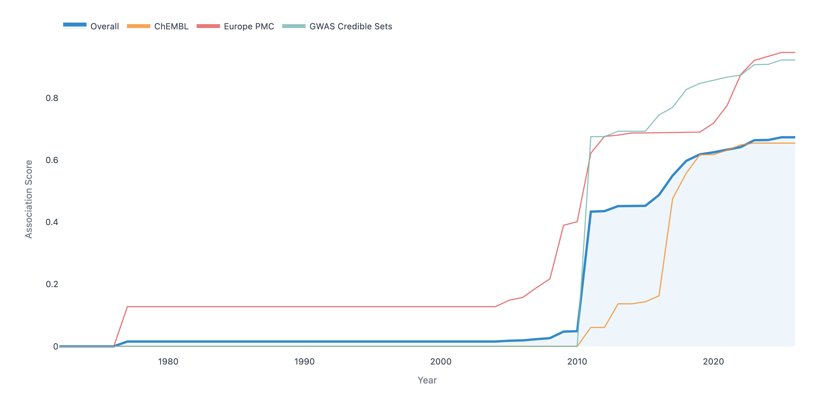
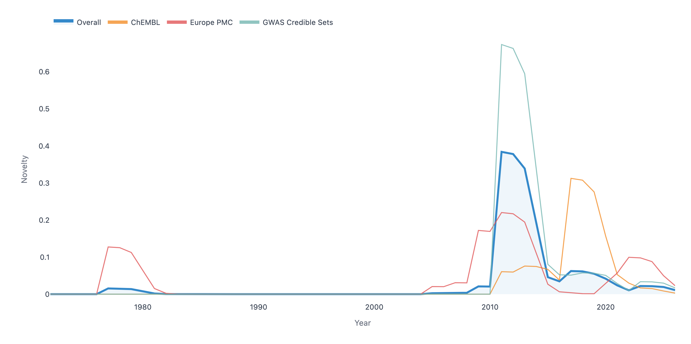

# Timeseries Prototype

> **Prototype** — This application is an exploratory proof-of-concept intended to demonstrate how the evolution of target–disease association evidence can be visualised over time. It is not production-ready and is explicitly designed to inform future integration into the [Open Targets Platform](https://platform.opentargets.org).

## Overview

The Open Targets Platform aggregates evidence linking targets (genes/proteins) to diseases. Over time, the strength and composition of these associations changes as new data sources are incorporated, publications appear, and evidence is revised. This prototype makes that temporal dimension visible.

Key capabilities:

- **Timeseries visualisation** — plot how association scores and their contributing datasources evolve year by year for any target–disease pair.
- **Association novelty** — identify pairs where evidence has grown rapidly or recently, highlighting potentially novel or emerging associations.
- **Interactive search** — autocomplete search for targets (by gene symbol) and diseases (by name) backed by a local DuckDB database.

The prototype is intentionally lightweight — a single-page frontend served by a FastAPI backend with a pre-built DuckDB database — so that it can be run locally without infrastructure dependencies.

## Screenshots

Example: **TSLP / asthma** (ENSG00000145777 · MONDO:0004979)

| Association score over time | Novelty over time |
|---|---|
|  |  |

## Architecture

```
timeseries_prototype/
├── index.html              # Single-page frontend (vanilla JS)
├── timeseries.json         # Example data snapshot
├── pyproject.toml
├── backend/
│   ├── main.py             # FastAPI application & API endpoints
│   ├── build_db.py         # One-time DB build from Parquet files
│   ├── build_search.py     # Populates autocomplete search tables
│   └── timeseries.db       # DuckDB database (generated)
```

The backend exposes three API endpoints:

| Endpoint | Description |
|---|---|
| `GET /api/search/targets?q=` | Autocomplete search for targets by gene symbol |
| `GET /api/search/diseases?q=` | Autocomplete search for diseases by name |
| `GET /api/timeseries?targetId=&diseaseId=` | Full timeseries for a target–disease pair |

## Prerequisites

- Python ≥ 3.11
- [uv](https://github.com/astral-sh/uv) package manager

## Setup

### 1. Install dependencies

```bash
uv sync
```

### 2. Build the database

The application requires a DuckDB database built from Open Targets Parquet timeseries data.

```bash
uv run timeseries-build-db <parquet_dir> [--db PATH] [--skip-index]
```

| Argument | Description | Default |
|---|---|---|
| `parquet_dir` | Directory containing `*.parquet` timeseries files | required |
| `--db PATH` | Output database path | `backend/timeseries.db` |
| `--skip-index` | Skip index creation (faster build, slower queries) | off |

Expected scale: ~160 files, ~760 M rows. Import takes 5–10 min; index creation 15–30 min.

### 3. Build the search tables

Populate the autocomplete tables from dedicated search Parquet files:

```bash
uv run timeseries-build-search [--db PATH] [--target-dir DIR] [--disease-dir DIR]
```

| Argument | Description | Default |
|---|---|---|
| `--db PATH` | Database to update | `backend/timeseries.db` |
| `--target-dir DIR` | Directory of target search Parquet files | `<project_root>/search_target` |
| `--disease-dir DIR` | Directory of disease search Parquet files | `<project_root>/search_disease` |

### 4. Run the application

```bash
uv run timeseries-serve
```

The application will be available at [http://localhost:8000](http://localhost:8000).
Interactive API docs are available at [http://localhost:8000/api/docs](http://localhost:8000/api/docs).

## Future work

This prototype is a stepping stone towards a native feature in the Open Targets Platform. Planned directions include:

- Integration of timeseries data into the Platform's target–disease association pages
- A formal novelty score surfaced alongside existing association scores
- Server-side rendering within the Platform's Next.js frontend
- Scalable data access via the Platform's existing GraphQL API

## Disclaimer

All data used by this prototype is derived from Open Targets public releases. The novelty metrics and visualisations are experimental and should not be used for clinical or research decisions without independent validation.
